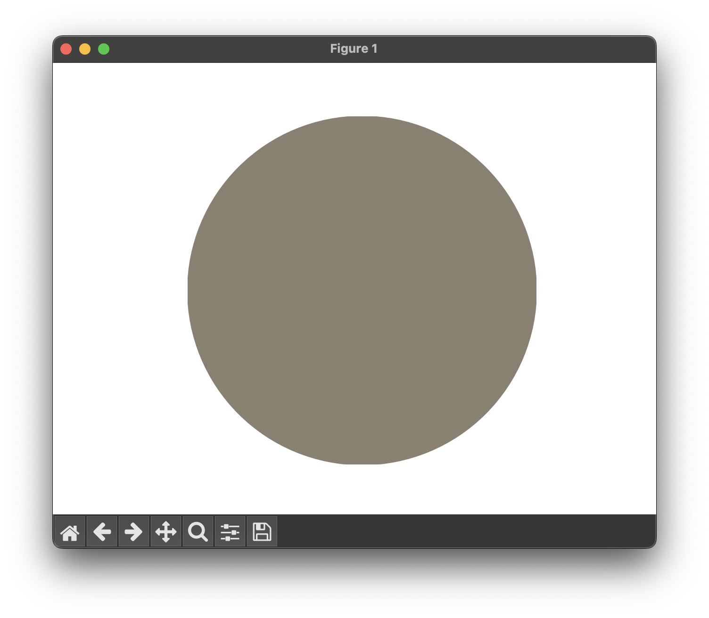
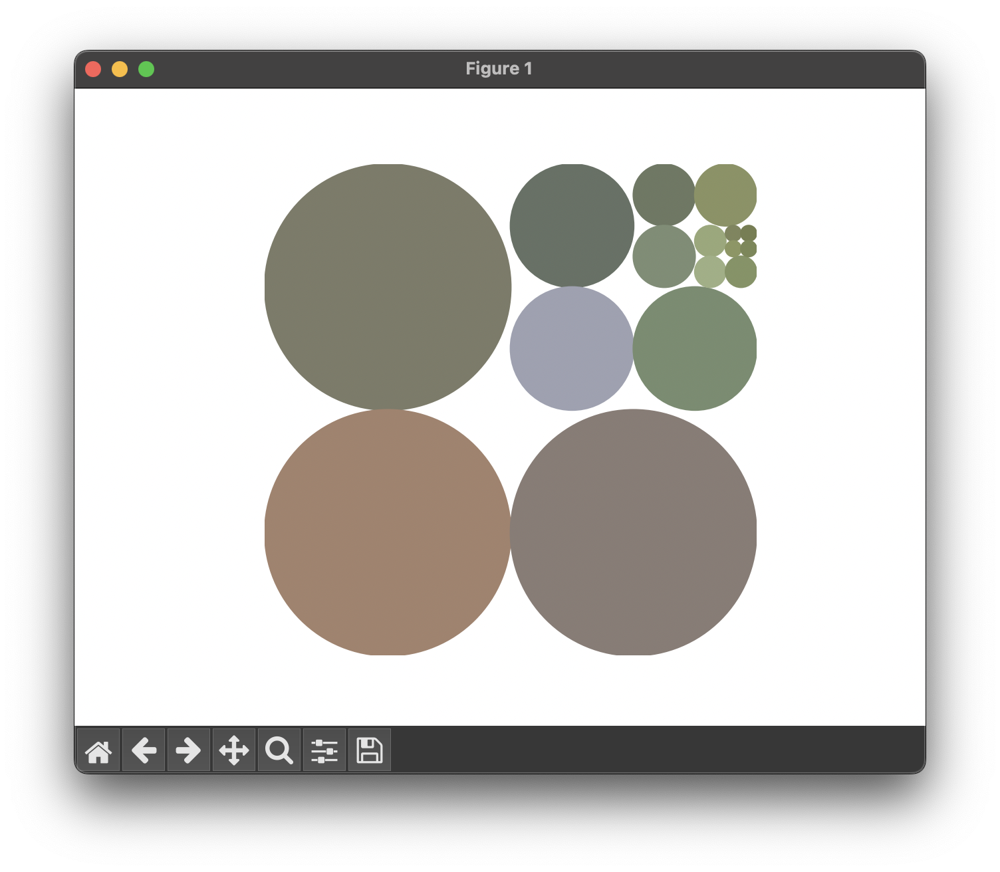
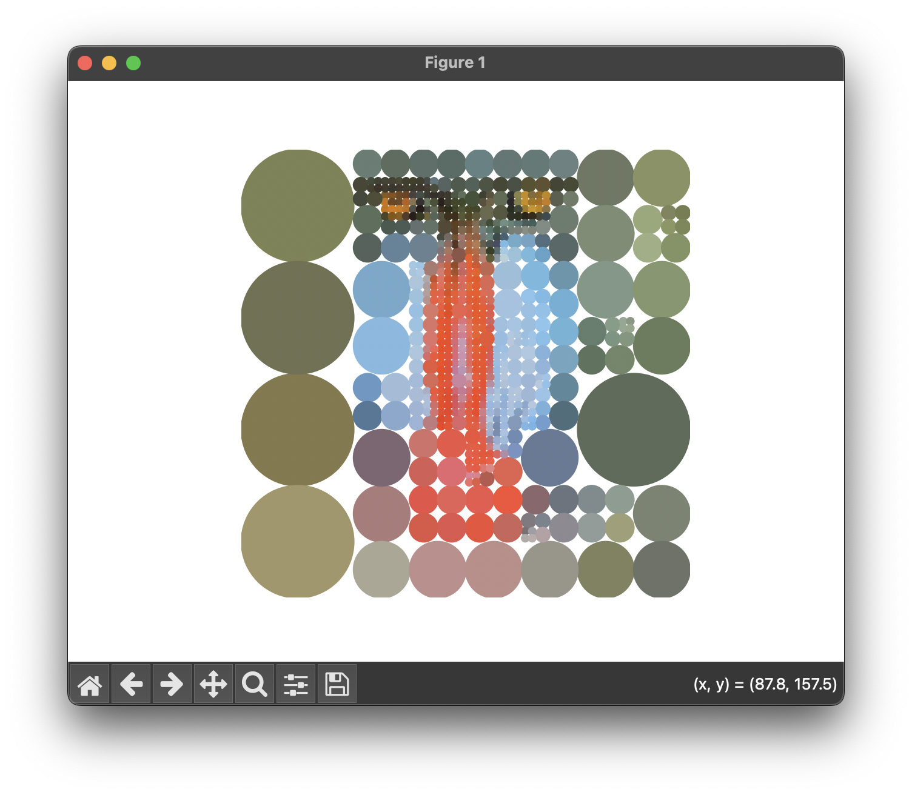
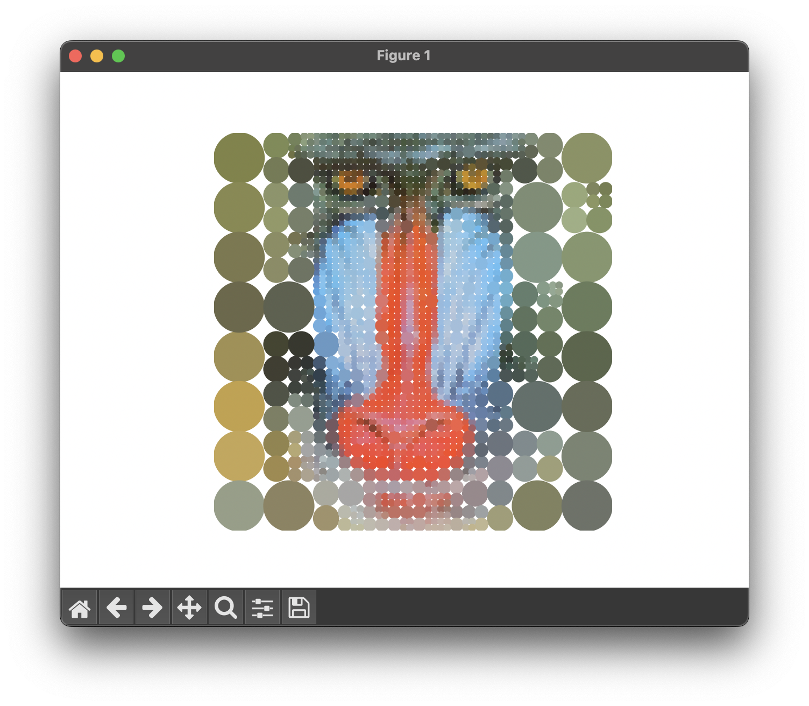

# pixplode - An Interactive Quadtree Renderer

### Description
This script will interactively construct and display a quadtree representation of a provide image.  Starting at the root node which represents the mean color of the entire image, the selected nodes will split into 2x2 (quadtree) nodes where the leaves for each split node will represent the mean color of the region-of-interest covered by each leaf at this level in the tree.

This code produces an intriguing visualization and "reveal" of the image as well as an instructional view of quadtree representations.

### Inspiration
The great site posted by Vadim Ogievetsky and Annie Albagli (https://www.koalastothemax.com)


### Usage
```
usage: pixplode.py [-h] [-e {hover,click}] [-m MINIMUM_SIZE_PIXEL]
                   [-s {circle,rectangle}] [-r RESIZE_MAXIMUM_DIMENSION_TO]
                   [-o OUTPUT_IMAGE_PATH]
                   image_path

Interactively render an image to finer and finer resolution

positional arguments:
  image_path            Path to the image file to render

options:
  -h, --help            show this help message and exit
  -e, --event-type {hover,click}
                        Event type that triggers a split [default is hover]
  -m, --minimum-size-pixel MINIMUM_SIZE_PIXEL
                        Minimum size image element to display [default is 4]
  -s, --shape {circle,rectangle}
                        Shape of the image element to display [default is
                        circle]
  -r, --resize-maximum-dimension-to RESIZE_MAXIMUM_DIMENSION_TO
                        Desired size for the maximum image dimension [default
                        is 256]
  -o, --output-image-path OUTPUT_IMAGE_PATH
                        Output file path to save image to on exit [default is
                        None]
```

### Example
```
python3 pixplode.py images/mandrill.tif
```

Initially produces the following, a single node illustrating the average color for the provide image



After moving the cursor over the image (repeatedly), the following figures provide illustrations of the progress that is made interactively revealing nodes of the quadtree image representation








# Requirements

### Base Python
argparse  
time  
pathlib  
typing  

### Third-Party Modules
cv2  
matplotlib  
numpy  

See [requirements.txt](requirements.txt) for necessary versions of third-party module.

If installation of these third-party modules is required, simply type
```
pip install -r requirements.txt
```

&nbsp;
# Contact

### Author  
Carl Salvaggio, Ph.D.

### E-mail
carl.salvaggio@rit.edu

### Organization
Chester F. Carlson Center for Imaging Science  
Rochester Institute of Technology  
Rochester, New York, 14623  
United States

